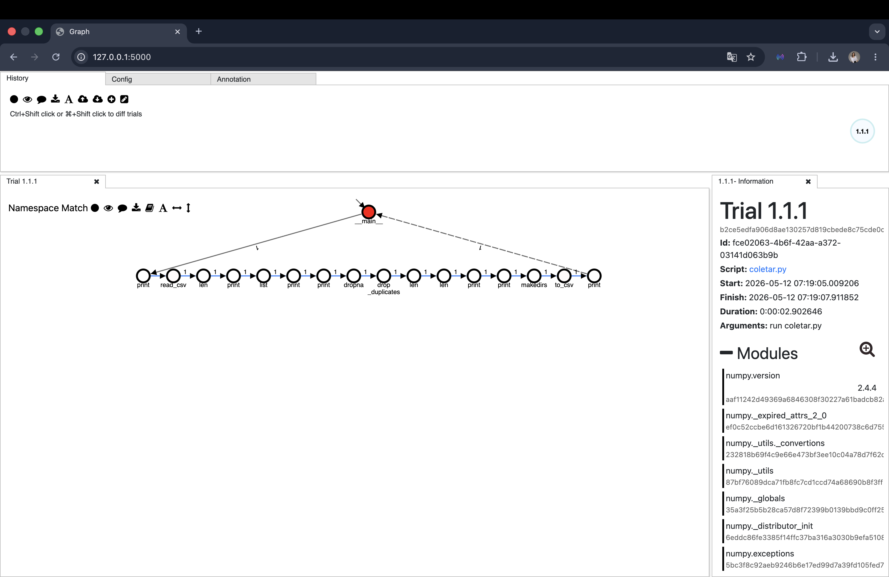

# Proveniência em Dados de Saúde Mental em Redes Sociais

Este repositório apresenta o trabalho final da disciplina **eScience 2026.1**. O projeto tem como foco o processamento reprodutível de dados do Reddit, com captura automática de proveniência utilizando a ferramenta **noWorkflow**.

## Motivação

O Reddit é uma plataforma que, devido ao anonimato dos usuários, concentra relatos espontâneos e autênticos sobre saúde mental, muitos deles não capturados por métodos tradicionais, como surveys clínicos.

Entretanto, identificamos uma lacuna crítica na literatura:

- **Estudos prévios:** pelo menos 54 estudos científicos já utilizaram dados do Reddit para investigar depressão e ansiedade.
- **Problema:** a ausência de registro detalhado, como data, hora, parâmetros da API e etapas de processamento, torna esses estudos pouco transparentes e difíceis de reproduzir.

Sem rastreabilidade, os experimentos tornam-se verdadeiras "caixas pretas".

## Objetivos

O objetivo principal deste projeto é realizar o processamento de dados com **proveniência completa e rastreável**, garantindo transparência e reprodutibilidade.

- **Fonte de dados:** baixar um dataset público do Kaggle com posts de subreddits de saúde mental.
- **Processamento:** limpar, separar e salvar os dados por categoria.
- **Proveniência:** empregar o noWorkflow para registrar automaticamente a linhagem dos dados.
- **Transparência:** disponibilizar um repositório público com código documentado e demonstração funcional.

## Requisitos

- Python 3.11. O noWorkflow 2.0.1 pode falhar em versões mais novas do Python.
- pip.
- virtualenv ou o módulo `venv` do Python.

## Instalação

1. Clone o repositório:

```bash
git clone <url-do-repositorio>
cd EScienceReddit
```

2. Crie um ambiente virtual com Python 3.11:

Linux/macOS:

```bash
python3.11 -m venv .venv
source .venv/bin/activate
```

Windows PowerShell:

```powershell
py -3.11 -m venv .venv
.\.venv\Scripts\Activate.ps1
```

3. Instale as dependências:

```bash
python -m pip install -r requirements.txt
```

As dependências do projeto estão centralizadas no `requirements.txt`, incluindo `pandas`, `openpyxl`, `kagglehub`, `certifi`, `pip-system-certs`, `praw`, `noworkflow[all]` e `setuptools<68`.

4. Verifique a instalação:

```bash
python --version
now --version
```

A versão esperada do Python é `3.11.x`. A versão esperada do noWorkflow é `noWorkflow 2.0.1`.

Se o comando `now` não for reconhecido, use o executável dentro do ambiente virtual:

Linux/macOS:

```bash
.venv/bin/now --version
```

Windows PowerShell:

```powershell
.\.venv\Scripts\now.exe --version
```

## Fonte de Dados

Este projeto usa o dataset público [Mental Health Reddit Dataset - Kaggle](https://www.kaggle.com/datasets/neelghoshal/reddit-mental-health-data).

O dataset contém posts de subreddits relacionados a conversas sobre saúde mental. A coluna `target` usa o seguinte mapeamento:

- `0`: Stress
- `1`: Depression
- `2`: Bipolar disorder
- `3`: Personality disorder
- `4`: Anxiety

## Baixar o Dataset

Com o ambiente virtual ativado, execute:

```bash
python baixar_dataset.py
```

O script baixa o dataset com `kagglehub`, encontra o CSV ou XLSX com as colunas `text`, `title` e `target`, e copia o arquivo para:

```txt
data/data_to_be_cleansed.csv
```

ou:

```txt
data/data_to_be_cleansed.xlsx
```

## Executar com Proveniência

Com o ambiente virtual ativado, execute o pipeline com noWorkflow:

```bash
now run coletar.py
```

Se `now` não estiver disponível no terminal, use:

Linux/macOS:

```bash
.venv/bin/now run coletar.py
```

Windows PowerShell:

```powershell
.\.venv\Scripts\now.exe run coletar.py
```

Ao final, serão gerados:

- `data/posts_limpos.csv`, com todos os dados limpos.
- `data/posts_stress.csv`
- `data/posts_depression.csv`
- `data/posts_bipolar_disorder.csv`
- `data/posts_personality_disorder.csv`
- `data/posts_anxiety.csv`

Os arquivos gerados usam `;` como separador para facilitar a abertura no Excel em português. O script também remove a coluna de índice `Unnamed: 0` e substitui quebras de linha internas por espaços.

## Consultar a Proveniência

Liste as execuções registradas:

```bash
now list
```

Mostre os detalhes de uma execução:

```bash
now show <sequence-key>
```

Exemplo:

```bash
now show 1
```

Se necessário, substitua `now` pelo caminho do executável no ambiente virtual:

```powershell
.\.venv\Scripts\now.exe list
.\.venv\Scripts\now.exe show 1
```

## Visualizar o Grafo

Inicie a interface visual do noWorkflow:

```bash
now vis
```

Ou, no Windows PowerShell:

```powershell
.\.venv\Scripts\now.exe vis
```

Depois acesse no navegador:

```txt
http://127.0.0.1:5000
```

## Metodologia

O fluxo de trabalho está estruturado em quatro etapas principais:

1. **Download do dataset**
   O script `baixar_dataset.py` baixa o dataset público do Kaggle e padroniza o arquivo de entrada.

2. **Registro de proveniência**
   O pipeline é executado com noWorkflow, capturando automaticamente parâmetros de execução, dependências e transformações aplicadas.

3. **Processamento**
   O script `coletar.py` limpa os dados, remove duplicatas, normaliza textos e separa os posts por categoria.

4. **Visualização**
   O noWorkflow permite consultar os metadados da execução e visualizar o grafo de proveniência.

## Grafo de Proveniência

O grafo abaixo mostra toda a cadeia de execução registrada pelo noWorkflow, desde a leitura do dataset bruto até o salvamento dos arquivos CSV limpos.



## Entregáveis

- **Script em Python:** pipeline completo de download e processamento.
- **Visualização:** grafo de proveniência representando o fluxo de dados.
- **Repositório:** código documentado com instruções de uso e demonstração funcional.

## Equipe

- Giovana Beltrame
- Julia Staudohar
- Marianna Brito

**Graduação em eScience**
